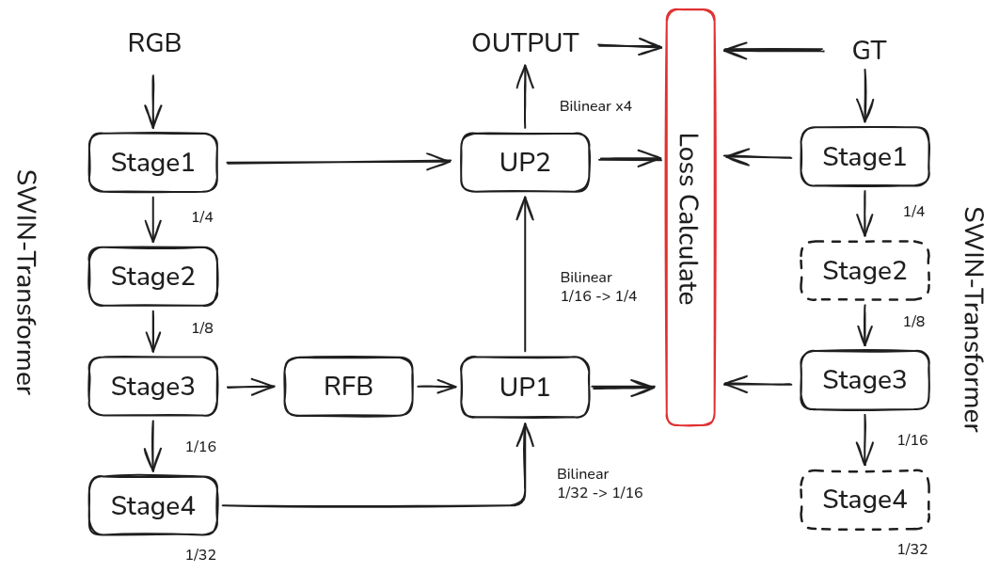

# TwinSwin-Matte: DIS-Inspired Dual Encoder for Image Matting

TwinSwin-Matte is an experimental high-resolution image matting architecture. It leverages a Dual Encoder design (Student-Teacher) to explicitly learn structural consistency between RGB images and Ground Truth Alpha Mattes.

This project is heavily inspired by the intermediate supervision mechanisms found in DIS (Dichotomous Image Segmentation). We attempt to adapt the "Feature Consistency" concept from DIS—typically used for binary segmentation—to the more delicate task of Alpha Matting (regression).

⚠️ Current Status: The model demonstrates strong capability in capturing semantic subjects and general structures. However, extremely fine details (e.g., individual floating hair strands) are still being optimized. This is an ongoing experiment to validate if geometric feature alignment can boost matting performance.

### 🌟 Key Features

- Twin-Tower Architecture (Dual Swin Encoders):
Image Encoder (Student): Extracts features from the input RGB image.
GT Encoder (Teacher): Extracts "perfect" structural features from the Ground Truth Alpha (Training only).

- DIS-Inspired Feature Supervision:
Instead of only calculating loss on the final output, we align the intermediate features of the Image Encoder with the GT Encoder. This forces the model to learn "structure-aware" representations early in the network.

- Matting-Specific Optimization:
Loss Functions: Combined L1 Loss (Pixel fidelity) + Feature Consistency Loss (Structural alignment).
Metrics: Optimized for MSE (Mean Squared Error) and Pixel Accuracy (derived from MAD).

- Production-Ready Inference:
Supports dynamic resizing (Training on 768x768, Inference on 1024x1024).
Outputs Alpha Matte, Composite on Checkerboard, and Green Screen visualization.


---
### 🧠 Model Architecture
The core idea is Knowledge Distillation / Feature Alignment:
Teacher Stream (GT Encoder): Frozen Swin-Tiny backbone taking the Mask as input.
Student Stream (Image Encoder): Active Swin-Tiny backbone taking the RGB Image as input.
Adapter Modules: 1x1 Convolutions that "translate" RGB features into the Geometric feature space for loss calculation.
Lightweight Decoder: A unified 64-channel decoder with RFB (Receptive Field Block) for efficient upsampling.



---
### 📂 Project Structure

```
TwinSwin-Matte/
├── checkpoints/       # Saved models and logs
├── models/
│   ├── blocks.py      # Basic blocks (DoubleConv, RFB) with GroupNorm
│   ├── twin_swin_matte.py # The Dual Encoder Architecture
├── utils/
│   ├── dataset.py     # MattingDataset (Handling DIS-5K structure)
│   ├── loss.py        # Composite Loss (L1 + Feature MSE)
│   ├── metrics.py     # MSE & Accuracy calculation
│   ├── logger.py      # CSV Logger (SAD, MSE, MAD)
│   └── plot.py        # Training visualization curves
├── config.py          # Hyperparameters (Img Size: 1024, Batch: 2)
├── train.py           # Main training script with Feature Supervision
├── predict.py         # Inference script (Alpha & Composite generation)
├── preprocess_dis5k.py # Helper to flatten DIS-5K dataset
└── README.md
```

---
### 🛠️ Installation
Clone the repository

```bash
git clone https://github.com/Jacky-0202/TwinSwin-Matte.git
cd TwinSwin-Matte
```

Install dependencies

```bash
pip install torch torchvision timm tqdm matplotlib pandas opencv-python
```

Prepare Dataset (DIS-5K) We use the DIS-5K dataset. Since the original structure is nested, use our helper script to flatten it.

Download DIS-5K.

Configure paths in `preprocess_dis5k.py` .

Run:

```bash
python preprocess_dis5k.py
```

Resulting Structure:

```
Datasets/DIS5K_Flat/
├── train/
│   ├── im/  # Images
│   └── gt/  # Masks
├── val/
└── test/
```

---
### 🚀 Usage
1. Training
The model uses Swin-Tiny by default to balance performance and VRAM usage (since we run two backbones).

```bash
python train.py
```

Configuration: Check config.py. We recommend IMG_SIZE = 768 or 1024 for Matting.
Monitoring: Logs are saved to checkpoints/TwinSwin_Tiny_DIS5K/training_log.csv.

2. Inference (Testing)
To generate Alpha Mattes for your own images:

```bash
python predict.py
```

Input: Place images in test_data/.
Output: Results (Alpha Matte & Composite) saved to test_results/.

---
### 📊 Experimental Results & Observations
This project serves as an experiment to verify if Intermediate Feature Supervision (from DIS) works for Matting.

Observations:

The General Structure convergence is very fast. The model quickly learns to separate the main subject from the background.
Feature Alignment helps significantly in ambiguous regions (e.g., similar colors between foreground and background).

Limitations:

Fine Detail (Hair): While the global shape is accurate, pixel-perfect hair segmentation (the "translucency" part) is still under optimization. The current MSE-based loss sometimes smooths out high-frequency details. Future work will involve integrating Laplacian Loss or Gradient Loss.

---
### 🤝 References

- [Swin Transformer](https://github.com/microsoft/Swin-Transformer)
- [DIS (IS-Net)](https://github.com/xuebinqin/DIS)

