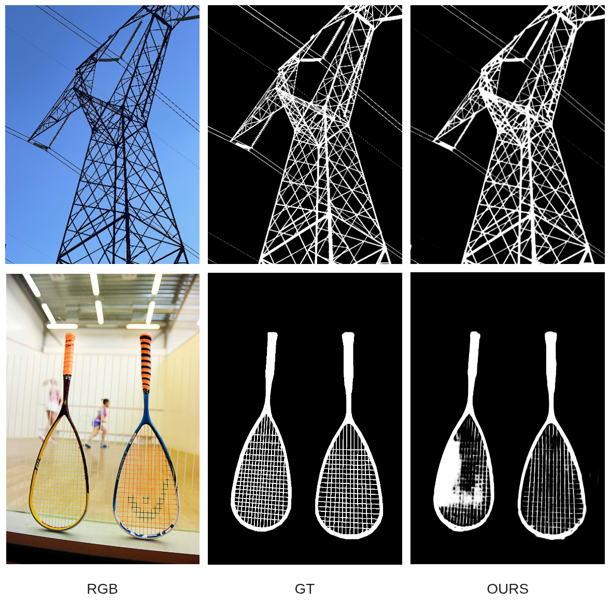
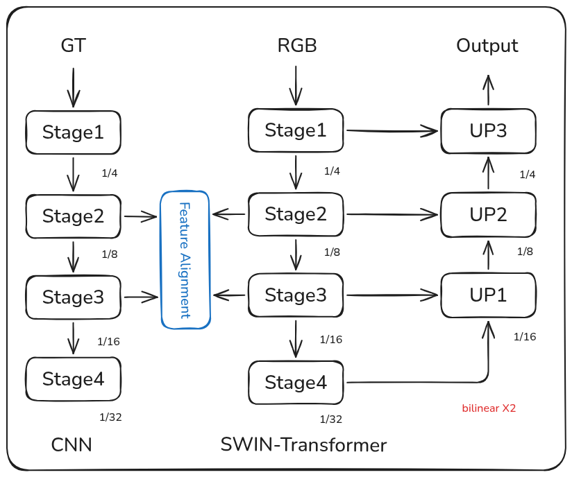

# TwinSwin-Matte: High-Resolution Deep Matting with Twin-Swin Encoders

**TwinSwin-Matte** is an advanced, high-resolution image matting architecture designed for precision and structural consistency. It leverages a **Dual Encoder (Twin-Tower)** design to distill structural knowledge from Ground Truth masks directly into the RGB feature extraction process.

Inspired by the feature consistency mechanisms in **DIS (Dichotomous Image Segmentation)** and the boundary-aware losses of **BiRefNet**, this project adapts these concepts for the delicate task of Alpha Matting.

> **🚀 Current Status:**
> * **Hardware Optimized**: Trained on **NVIDIA H200 (141GB VRAM)**.
> * **Resolution**: Native **1024x1024** training.
> * **Performance**: Achieves high-precision edge alignment without requiring a trimap, effectively serving as a robust "Matting-Level" background remover.

---

### 🌟 Key Features

* **Twin-Tower Architecture (Dual Swin Encoders)**
    * **Student (RGB Encoder)**: Swin-Base backbone extracting semantic and textural features from images.
    * **Teacher (Mask Encoder)**: Frozen Swin backbone extracting "perfect" structural features from GT Alpha (Training only).

* **Feature Alignment Strategy**
    * Instead of relying solely on final output loss, we align the *intermediate deep features* (Stage 2 & 3) of the Student with the Teacher. This forces the model to "think" like a structure-aware network.

* **Ultimate Matting Loss**
    * We moved beyond simple MSE. The model is trained with a hybrid loss inspired by **BiRefNet**:
        * **Structure Loss**: Weighted BCE + IoU focused on hard-to-segment edges.
        * **L1 Loss**: For pixel-perfect alpha regression.
        * **Gradient Loss**: Enforcing sharp, non-blurry boundaries.

* **Production-Grade Inference**
    * Designed for **1024x1024** high-res inference.
    * No post-processing (e.g., dilation/erosion) required; the model outputs ready-to-use alpha mattes.



---

### 🧠 Model Architecture

The architecture follows a U-Net shape with a specialized distillation mechanism:

1.  **Backbone**: **Swin Transformer (Base)** pretrained on ImageNet.
2.  **Twin Alignment**:
    * **Teacher Stream**: Takes GT Mask $\rightarrow$ Extracts structural embeddings.
    * **Student Stream**: Takes RGB Image $\rightarrow$ Extracts image embeddings.
    * **Loss**: $L_{feat} = MSE(F_{student}, F_{teacher})$ applied at high-level semantic stages.
3.  **Decoder**:
    * Features are upsampled and fused via skip connections.
    * Outputs a single-channel Alpha Matte (Logits).



---
### 📂 Project Structure

```
TwinSwin-Matte/
├── checkpoints/       # Saved models and logs
├── models/
│   ├── blocks.py      # Basic blocks (DoubleConv, RFB) with GroupNorm
│   ├── twin_swin_matte.py # The Dual Encoder Architecture
├── utils/
│   ├── dataset.py     # MattingDataset (Handling DIS-5K structure)
│   ├── loss.py        # Composite Loss (L1 + Feature MSE)
│   ├── metrics.py     # MSE & Accuracy calculation
│   ├── logger.py      # CSV Logger (SAD, MSE, MAD)
│   └── plot.py        # Training visualization curves
├── config.py          # Hyperparameters (Img Size: 1024, Batch: 2)
├── train.py           # Main training script with Feature Supervision
├── predict.py         # Inference script (Alpha & Composite generation)
├── preprocess_dis5k.py # Helper to flatten DIS-5K dataset
└── README.md
```

---
### 🛠️ Installation
- Clone the repository

```bash
git clone https://github.com/Jacky-0202/TwinSwin-Matte.git
cd TwinSwin-Matte
```

-Create and Activate Virtual Environment

```bash
# Create virtual environment named '.venv'
python -m venv .venv

# Activate it (Linux/macOS)
source .venv/bin/activate

# Activate it (Windows)
# .venv\Scripts\activate
```

- Install dependencies

```bash
pip install -r requirements.txt
```

- Prepare Dataset (DIS-5K) We use the DIS-5K dataset. Since the original structure is nested, use our helper script to flatten it.

Download DIS-5K.

Configure paths in `preprocess_dis5k.py` .

Run:

```bash
python preprocess_dis5k.py
```

Resulting Structure:

```
Datasets/DIS5K_Flat/
├── train/
│   ├── im/  # Images
│   └── gt/  # Masks
├── val/
└── test/
```

---
### 🚀 Usage
1. Training
The model uses Swin-Tiny by default to balance performance and VRAM usage (since we run two backbones).

```bash
python train.py
```

Configuration: Check config.py. We recommend IMG_SIZE = 768 or 1024 for Matting.
Monitoring: Logs are saved to checkpoints/TwinSwin_Tiny_DIS5K/training_log.csv.

2. Inference (Testing)
To generate Alpha Mattes for your own images:

```bash
python predict.py
```

Input: Place images in test_data/.
Output: Results (Alpha Matte & Composite) saved to test_results/.

---
### 📊 Experimental Results & Observations
This project serves as an experiment to verify if Intermediate Feature Supervision (from DIS) works for Matting.

Observations:

The General Structure convergence is very fast. The model quickly learns to separate the main subject from the background.
Feature Alignment helps significantly in ambiguous regions (e.g., similar colors between foreground and background).

Limitations:

Fine Detail (Hair): While the global shape is accurate, pixel-perfect hair segmentation (the "translucency" part) is still under optimization. The current MSE-based loss sometimes smooths out high-frequency details. Future work will involve integrating Laplacian Loss or Gradient Loss.

---
### 🤝 References

- [Swin Transformer](https://github.com/microsoft/Swin-Transformer)
- [DIS (IS-Net)](https://github.com/xuebinqin/DIS)

